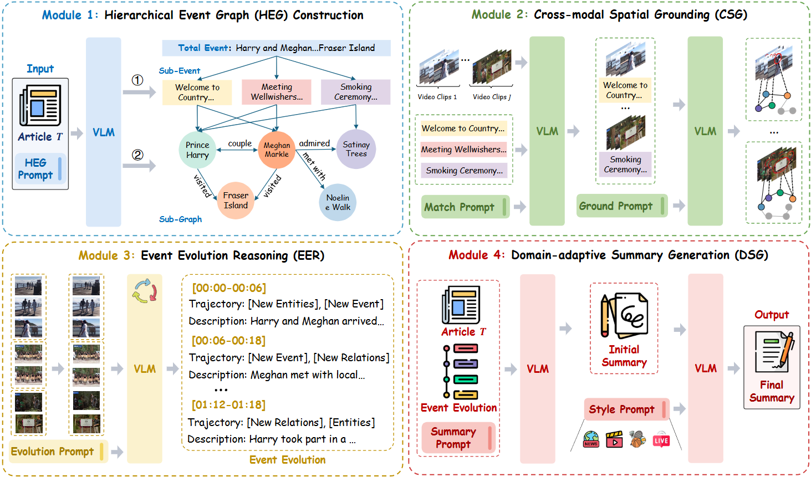

# CoE: Training-free Multimodal Summarization via Chain-of-Events

This repository contains the official implementation of "Cut to the Chase: Training-free Multimodal Summarization via Chain-of-Events" (Accepted as CVPR 2026).




---

## 🌟 1. Overview

CoE tackles long-video multimodal summarization by explicitly structuring the generation process around **events** and **cross-modal grounding**. Instead of end-to-end finetuning, CoE is **training-free** and focuses on **robust reasoning + evidence alignment**.


✅ **Key properties**

* Training-free & plug-and-play across datasets/domains
* Event-centric structure improves coherence and coverage
* Cross-modal grounding reduces hallucination and strengthens faithfulness

---

## 🧠 2. What CoE Contributes

🌟 **CoE contributes an event-driven, training-free MMS framework** that you can apply to multiple datasets with unified data access.

**Core contributions**

* 🧩 **Chain-of-Events reasoning**: organizes summaries around event progression rather than isolated captions.
* 🔎 **Cross-modal evidence grounding**: aligns textual claims to video evidence for improved factuality.
* 🧠 **Reason-then-write**: decouples content reasoning from style realization for better generalization.

---

## 📊 3. Performance Highlights

📈 CoE is evaluated on **8 MMS datasets** using widely adopted metrics:

* **Lexical**: BLEU-4, ROUGE
* **Semantic / Consensus**: METEOR, CIDEr, BERTScore
* **Factual / Entity**: entity-level F1 (grounding-oriented)

CoE achieves top-tier performance across most dataset-metric pairs, and shows particularly strong gains on CIDEr and ROUGE for long-video MMS.

---

## 🗂️ 4. Data

### 🧾 4.1 Datasets

Below are the eight benchmarks used in the paper (covering **news / academic / sports / entertainment / livestream**).

| Dataset                 | Domain             | Typical Input                | Output                           |
| ----------------------- | ------------------ | ---------------------------- | -------------------------------- |
| **VIEWS**               | News               | video + storyline   | news-style summary               |
| **MM-AVS**              | News               | video + news article   | concise summary                  |
| **XMSMO-News**          | News               | long video + text            | news title                |
| **TIB**                 | Lecture            | lecture video + transcript   | summary                  |
| **VISTA**               | Academic           | talk video + transcript      | paper abstract           |
| **BLiSS**               | Livestream         | long livestream + transcript | extracted summary         |
| **SoccerNet-Caption** | Sports             | video + comments               | event-centric summary |
| **SummScreen3D** | Entertainment | episode + dialogue           | story-level recap                |


---

### 🗄️ 4.2 Unified MongoDB Storage

To make dataset handling clean and scalable, we normalize the **textual side** across datasets and store all examples in **MongoDB** with a consistent schema.
This enables CoE to **query different datasets in a unified way** and simplifies evaluation.

✅ Recommended MongoDB schema

| Field        | Type   | Description                                      |
| ------------ | ------ | ------------------------------------------------ |
| `video_id`   | string | unique sample id                                 |
| `video_path` | string | path to video                                    |
| `text`       | string | unified text input (transcript/article/dialogue) |
| `reference`  | string | ground-truth summary (if available)              |
| `meta`       | object | optional metadata (title, timestamps, url, etc.) |

📌 Minimal example document

```json
{
  "video_id": "000123",
  "video_path": "/data/views/videos/000123.mp4",
  "text": "Full transcript or article text here...",
  "reference": "Ground-truth summary here...",
  "meta": {"title": "News title", "date": "2025-01-01"}
}
```

---


## 🧰 5. Installation

### ✅ 5.1 Requirements

- Python **3.12+**
- MongoDB (local or remote instance)

---

### 📦 5.2 Setup

Clone the repository and create a clean environment:

```bash
git clone https://github.com/youxiaoxing/CoE.git
cd CoE

conda create -n coe python=3.12 -y
conda activate coe
````

Install all dependencies via `requirements.txt`:

```bash
pip install -r requirements.txt
```

---

## 🚀 6. Inference

CoE inference is driven by **`CoE/CoE.py`**.

### 🧾 6.1 Prepare a config file (example)

Create `config.json`:

```json
{
    "hf_endpoint": "https://hf-mirror.com",
    "mongo": {
      "host": "Mongodb_IP_Address",
      "port": 27017,
      "database": "mms"
    },
    "model": {
      "clients": [
        "http://IP_Address:Port/v1"
      ],
      "api_key": "-",
      "model_name": "Qwen2.5-VL-7B-Instruct",
      "max_tokens": 500,
      "temperature": 0.1,
      "current_client_idx": 0
    },
    "datasets": {
      "vista": {
        "collection": "vista",
        "query": {"graph": {"$exists": true}, "split": "test"},
        "video_path_template": "video_dataset/VISTA/{video_path}",
        "save_file": "./result/vista.jsonl",
        "json_save_file": "./result/vista.json",
        "prompt_type": "vista",
        "article_field": "storyline",
        "summary_key": "summary"
      }
    }
    "prompts": {
      "vista": {
        "subevent_match": "Please analyze the...",
        "summary_generation": "Based on the overall event...",
        "old_translate_style": "Based on the provided references...",
        "translate_style": "Based on the provided reference examples..."
      }
    }
}
```

### ▶️ 6.2 Run inference

```bash
python CoE/CoE.py --config config.json --dataset VIEWS
```


---


## ✅ 7. Evaluation

We provide two evaluation scripts corresponding to **different metric groups**:

- 📊 `compute_score.py` → standard summarization metrics  
- 🔎 `compute_score_entity.py` → entity-level factual evaluation  

Both scripts take a **folder of JSON result files** as input.

---

### 📏 7.1 Standard Summarization Metrics

Run:

```bash
python Evaluation/compute_score.py \
  --input_path outputs/
````

Optional (enable BERTScore):

```bash
python Evaluation/compute_score.py \
  --input_path outputs/ \
  --use_bert_score
```

📌 **Input format**

* A folder containing `.json` files
* Each file is a list of samples with:

```json
{
  "caption": "generated summary",
  "ref_caption": "ground-truth summary"
}
```

📌 **Computed metrics**

* **BLEU-1/2/3/4** → n-gram precision
* **ROUGE** → overlap-based recall
* **ROUGE-LSum** → long-sequence structure similarity
* **CIDEr** → consensus-based similarity
* **METEOR** → semantic + lexical alignment
* **BERTScore (optional)** → contextual semantic similarity

---

### 🔎 7.2 Entity-level Evaluation

Run:

```bash
python Evaluation/compute_score_entity.py \
  --input_path outputs/
```

---


## 📬 8. Contact

For questions, issues, or collaborations:
* 🧑‍💻 Open an issue: **GitHub Issues** tab

---

## 📚  9. Reference

```
@inproceedings{you2026CoE,
  title={Cut to the Chase: Training-free Multimodal Summarization via Chain-of-Events},
  author={Xiaoxing You and Qiang Huang and Lingyu Li and Xiaojun Chang and Jun Yu},
  booktitle={Proceedings of the IEEE/CVF Conference on Computer Vision and Pattern Recognition (CVPR)},
  year={2026}
}
```